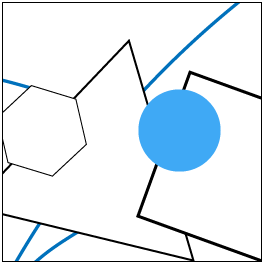
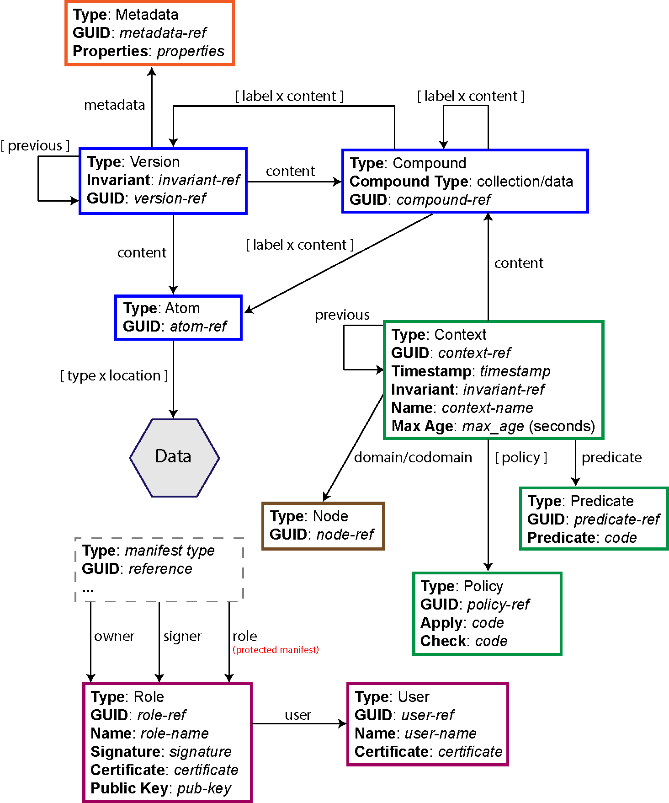

# SOS - Sea of Stuff



This is a prototype of a distributed autonomic personal data storage system.

## Goals

- **Location abstraction**. Users can perform data operations irrespective of where the data is stored and from where it is accessed.
- **Copying, Moving and Sharing**. Data and metadata can be copied, moved and shared across locations, users, and services at different granularities while retaining their properties.
- **Data Protection**. Data and metadata can be protected independently of locations and of each other. The result is the ability to protect data once and replicate it many times. It is also possible to protect data, while leaving metadata readable to everyone if one wishes to increase the data’s discoverability without necessarily giving access to the actual content.
- **Versioning**. Content can be versioned at different granularities.
- **Autonomic Data Management**. Users can automatically organise and enforce actions on data using well-defined rules.
- **Resiliency**. Resiliency over data is supported by the ability of the model to abstract entities over their locations. Entities are not trapped by a single system and can be replicated across multiple nodes or services without any loss of information, thus increasing the level of availability in the face of faults.
- **Users and Roles**. Users can play multiple roles and access different data views based on the role played.
- **Absence of Central Authority**. Entities can be exchanged across individual nodes without the need for a central authority.

---

## SOS Model

The SOS consists of content-addressable entities described by manifests. A manifest is
a self-describing and re-computable structured ‘document’ that stores information in clear
and can be published in the SOS to allow the discoverability of the entity it describes.
Manifests are named and addressed by content-addressable hashes (i.e., GUIDs). Each
SOS entity is described by a manifest of particular type, which has a certain well-defined
structure.


```
{
    "type" : <Manifest Type>,
    "guid" : hash(<Content to Hash>),
    ...
}
```

### Model

- Node Model
    - **Node**: A node is any physical device in the SOS network that can interact with other nodes by sending or receiving information to or from them. A node serves an access point to the SOS which is identifiable by a GUID. 
- Data Model
    - **Atom**: An atom is an immutable sequence of bytes identified by a GUID, deterministically derived from hashing the atom's sequence of bytes
    - **Compound**: A compound is a collection of SOS entities (atoms, compounds, etc.)
    - **Asset/Versions**: An asset is a mutable collection of immutable versions, which are linked to each other to form a Merkle DAG. Each version refers to some content, which can be an atom or a compound.
- Metadata Model
    - **Metadata**
- Users/Roles Model
    - **User**
    - **Role**
- Context Model
    - **Context**
    - **Predicate**
    - **Policy**




## SOS Architecture

### Node

A node is defined as an access point to the SOS that is uniquely identified by a GUID,
and has a pair of keys to digitally sign requests received by other nodes,
and provides a set of services to manage the SOS model.

### Services

- NMS - **Node Management Service**: allows nodes in the SOS to be discovered.
- MDMS - **Manifest-Data Management Service**: manages manifests and allows manifests and data stored in the SOS to be found.
- SMS - **Storage Management Service**: abstracts storage for atoms.
- MMS - **Metadata Management Service**: process metadata and abstracts the location of metadata.
- URMS - **Users/Roles Management Service**: manages users and roles.
- CMS - **Context Management Service**: manages contexts within the nodes and across the domain and codomain of contexts.


## More info on the SOS design

- Check the following repository: [sos-docs](https://github.com/sea-of-stuff/sos-docs)
- PhD thesis [here](https://sic2.me/resources/PhD-thesis-SOS-Conte.pdf).
- Systems Research group 2017 presentation: available soon.
- UK Systems Workshop 2019 (available soon): abstract, presentation.

<!-- The SOS has been developed as part of the PhD thesis: "The Sea of Stuff: a Model to Manage Shared Mutable Data in a Distributed Environment". The thesis will be available at a later date. -->

## Comparison with similar systems

See <a href="comparison.htm" target="_blank">comparison table</a>

<!-- ## Example applications

- WebApp
- SOS-WebDAV server
- SOS WebArchive
- git-to-sos -->

---

## Download

Download the stable releases from [here](https://github.com/sea-of-stuff/sos/releases) or checkout the [latest code](https://github.com/sea-of-stuff/sos).


## Contacts

Email Simone Conte (sic2@st-andrews.ac.uk) for additional information about the project.
